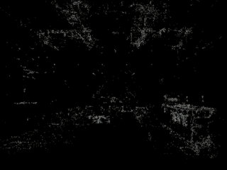
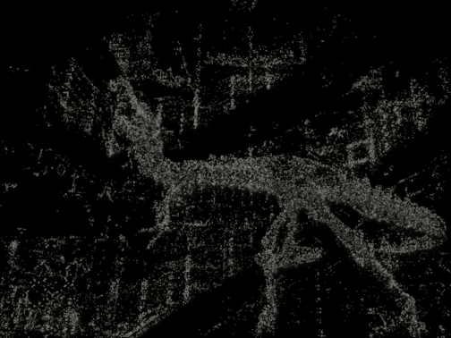

# Splat Apple: 3D Gaussian Splatting on Apple Silicon

This repository provides high-performance implementations of 3D Gaussian Splatting (3DGS) optimized for Apple Silicon (M1/M2/M3/M4). It supports both **MLX** and **PyTorch (MPS)** backends, delivering production-grade speeds that rival discrete GPU setups.

## Performance Highlights (Apple M4)

Benchmarked on the standard **Fern** scene (10,091 Gaussians):

| Backend | Implementation | Speed (Steady-State) | Speedup |
| :--- | :--- | :--- | :--- |
| **MLX** | **C++ Metal (GPU-Resident)** | **~42.3 it/s** | **50x** |
| **PyTorch** | **C++ (GCD)** | **~10.6 it/s** | **12x** |
| **MLX** | Pure Python (Reference) | ~1.2 it/s | 1.4x |
| **PyTorch** | Pure Python (Reference) | ~0.8 it/s | 1.0x |

**Fern Scene**  


**Pinecone Scene**  


**Room Scene**  


**T-Rex Scene**  


---

## Notes on C++ Rasterizer
On C++ mode, the rasterizer is implemented differently between MLX and PyTorch. MLX uses the full Metal Performance Shaders (MPS) framework, while PyTorch uses the GCD framework. This makes MLX able to achieve much higher performance than PyTorch, as it can fully utilize the GPU's parallel processing capabilities.

---

## Installation & Setup

### 1. Environment Setup (Conda)
It is recommended to use **Conda** to manage the environment for this project. 

Create and activate the `gs-mps` environment:
```bash
# Create the environment with Python 3.13
conda create -n gs-mps python=3.13 -y

# Activate the environment
conda activate gs-mps

# Install dependencies
pip install -r requirements.txt
```

### 2. Build MLX Native Extensions (Highly Recommended)
Required for the high-performance `cpp` mode in MLX.
```bash
python setup_mlx.py build_ext --inplace
```

### 3. Build PyTorch C++ Extensions
Required for the optimized `cpp` mode in PyTorch.
```bash
python setup.py build_ext --inplace
```

---

## Running Training

The training scripts are now generic and support any COLMAP-formatted dataset. Use the `--data_dir` flag to specify your dataset path.

### MLX Implementation (Fastest)
The MLX version is designed from the ground up for Apple's Unified Memory Architecture and features a full Metal-resident rasterizer.

```bash
# General usage
python train_mlx.py --data_dir /path/to/dataset --img_folder images_8 --rasterizer cpp

# Example: Fern dataset (LLFF)
python train_mlx.py --data_dir data/nerf_llff_data/fern --img_folder images_8 --rasterizer cpp

# Example: Pinecone dataset (Mip-NeRF 360) with normalization
python train_mlx.py --data_dir data/nerf_real_360/pinecone --img_folder images_8 --rasterizer cpp --normalize
```

### PyTorch Implementation
```bash
# General usage
python train_torch.py --data_dir /path/to/dataset --img_folder images_8 --rasterizer cpp

# Example: Fern dataset
python train_torch.py --data_dir data/nerf_llff_data/fern --img_folder images_8 --rasterizer cpp
```

### Helper Shell Scripts
For convenience, several shell scripts are provided to run training on specific datasets with pre-configured parameters:
```bash
# Train on Fern, Pinecone, Room, or T-Rex
sh train_fern.sh
sh train_pinecone.sh
sh train_room.sh
sh train_trex.sh
```
Note: You may need to edit the `data_dir` path inside these scripts to match your local setup.
---

## Benchmarking
To compare the performance of all implementations on your specific hardware:
```bash
export PYTHONPATH=$PYTHONPATH:.
python tests/benchmark_mlx_vs_torch.py --num_runs 10
```